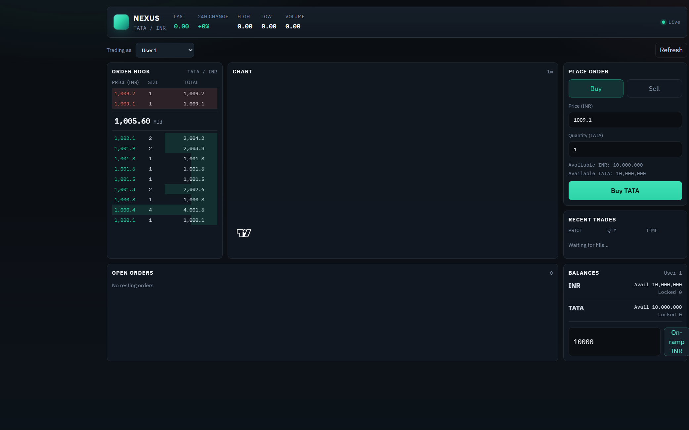
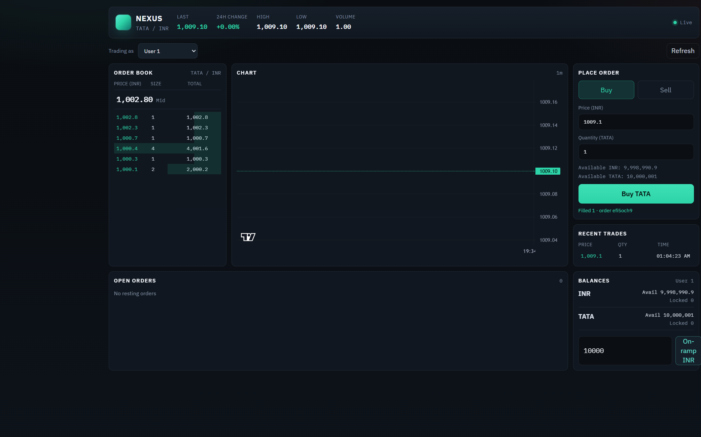
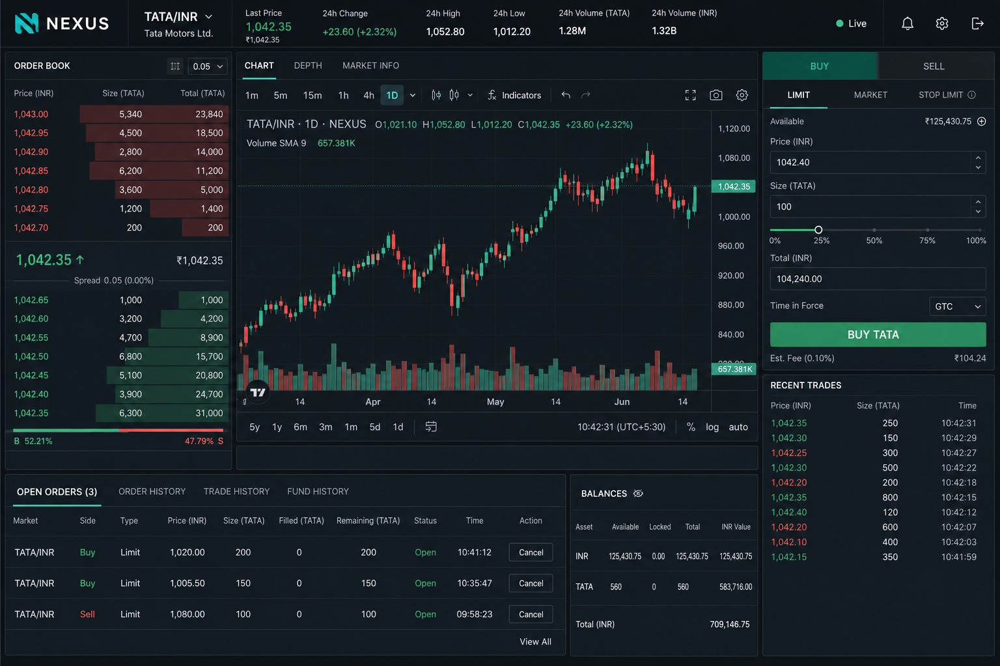
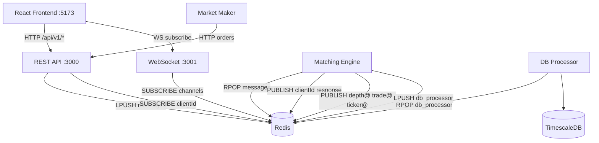
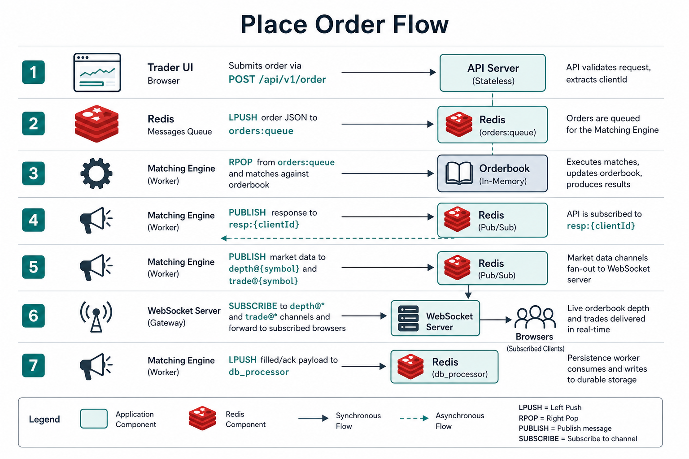
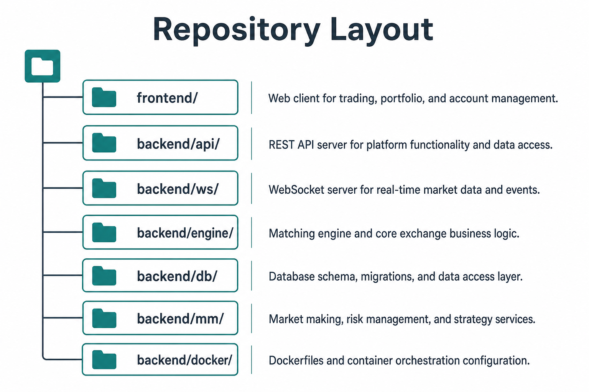

# Nexus Exchange

A full-stack **spot trading platform**: matching engine, REST API, WebSocket market data, optional TimescaleDB persistence, a market-maker bot, and a React + TypeScript trading terminal.

Default market: **`TATA_INR`** · Demo users: **`1`**, **`2`** · Market maker: **`5`**

---

## Working screenshots

### Live trading terminal (order book + balances)



*Captured against the running stack: live WebSocket, market-maker liquidity, User 1 balances.*

### After placing a fill



*Buy at 1009.1 filled immediately against resting asks — ticker, recent trades, and balances update in real time.*

### UI overview (annotated layout)



---

## System architecture


| Service | Port | Role |
|---------|------|------|
| `frontend` | `5173` | React trading UI |
| `backend/api` | `3000` | REST gateway to the engine |
| `backend/ws` | `3001` | Pub/sub fan-out for depth / trades / ticker |
| `backend/engine` | — | In-memory order books + balances |
| `backend/db` | — | Consumes `db_processor` → Postgres / TimescaleDB |
| `backend/mm` | — | Keeps ~15 bids and ~15 asks around mid |
| Redis | `6379` | Queues + pub/sub (required) |
| TimescaleDB | `5432` | Optional klines / history |

### How pieces talk



---

## Place-order flow



1. UI `POST /api/v1/order` with `{ market, price, quantity, side, userId }`
2. API `LPUSH`es `{ clientId, message }` onto Redis list `messages`
3. Engine `RPOP`s, locks funds, matches the order book (self-trade prevention)
4. Engine `PUBLISH`es `ORDER_PLACED` / `ORDER_CANCELLED` on `clientId`
5. Engine `PUBLISH`es `depth@MARKET`, `trade@MARKET`, `ticker@MARKET`
6. WS server forwards those streams to subscribed browsers
7. Engine `LPUSH`es trade/order events to `db_processor` for persistence

---

## Repository layout



```
exchange-platform/
├── frontend/                 # Vite + React + TypeScript trading UI
│   └── src/
│       ├── api/client.ts     # REST helpers
│       ├── hooks/useMarketSocket.ts
│       ├── components/       # OrderBook, TradeTicket, Chart, …
│       └── App.tsx
├── backend/
│   ├── api/                  # Express REST
│   ├── ws/                   # ws + Redis subscribe
│   ├── engine/               # Matching engine
│   ├── db/                   # Persistence worker
│   ├── mm/                   # Market maker bot
│   └── docker/               # Redis + TimescaleDB compose
├── docs/assets/              # Architecture + screenshots
└── package.json              # Root scripts
```

---

## Quick start

### Prerequisites

- Node.js 20+
- **Redis on `localhost:6379`** (required)
- Docker optional (TimescaleDB for historical klines)

```bash
# Infra (if Docker is available)
npm run docker:up

# Install all packages
npm run install:all
```

### Run (separate terminals)

```bash
npm run dev:engine      # matching engine
npm run dev:api         # http://localhost:3000
npm run dev:ws          # ws://localhost:3001
npm run dev:frontend    # http://localhost:5173
npm run dev:mm          # optional liquidity
```

Optional persistence:

```bash
npm run seed:db --prefix backend/db
npm run dev:db
```

---

## REST API (`:3000`)

| Method | Path | Description |
|--------|------|-------------|
| `POST` | `/api/v1/order` | Place limit order |
| `DELETE` | `/api/v1/order` | Cancel order |
| `GET` | `/api/v1/order/open?userId=&market=` | Open orders |
| `GET` | `/api/v1/order/balances?userId=` | Balances |
| `POST` | `/api/v1/order/onramp` | Credit INR |
| `GET` | `/api/v1/depth?symbol=` | Order book |
| `GET` | `/api/v1/trades?market=` | Recent trades |
| `GET` | `/api/v1/tickers` | Market tickers |
| `GET` | `/api/v1/klines?...` | Candles (needs DB) |

Example:

```bash
curl -X POST http://localhost:3000/api/v1/order \
  -H "content-type: application/json" \
  -d '{"market":"TATA_INR","price":"1005","quantity":"1","side":"buy","userId":"1"}'
```

---

## WebSocket (`:3001`)

Subscribe:

```json
{ "method": "SUBSCRIBE", "params": ["depth@TATA_INR", "trade@TATA_INR", "ticker@TATA_INR"] }
```

Unsubscribe:

```json
{ "method": "UNSUBSCRIBE", "params": ["depth@TATA_INR"] }
```

Messages look like `{ "type": "depth" | "trade" | "ticker", "data": { ... } }`.

---

## Frontend features

- Live order book (REST snapshot + WS deltas) with mid price
- Limit buy / sell ticket with available balances
- Recent trades tape
- Open orders + cancel
- Balances + INR on-ramp
- Candlestick chart (`lightweight-charts`; klines when DB is up, otherwise trade-seeded)
- Demo user switcher (`1` / `2` / market maker `5`)

---

## Engine notes

- In-memory books + balances; optional `WITH_SNAPSHOT=1` + `snapshot.json`
- Self-trade prevention (won’t match your own resting orders)
- Incremental depth maps for fast book updates
- Correct aggressor / `isBuyerMaker` flags on trades

---

